# Calcul différentiel sur les espaces de mesure

Ce cours introduit le calcul différentiel sur les espaces de mesures, via le  transport optimal. Le but sera de présenter le cadre et les outils, ainsi que la descente de gradient sur les espaces de mesures, en préparation d'exposés ultérieurs sur les applications aux réseaux de neurones.

Notes de cours:

| 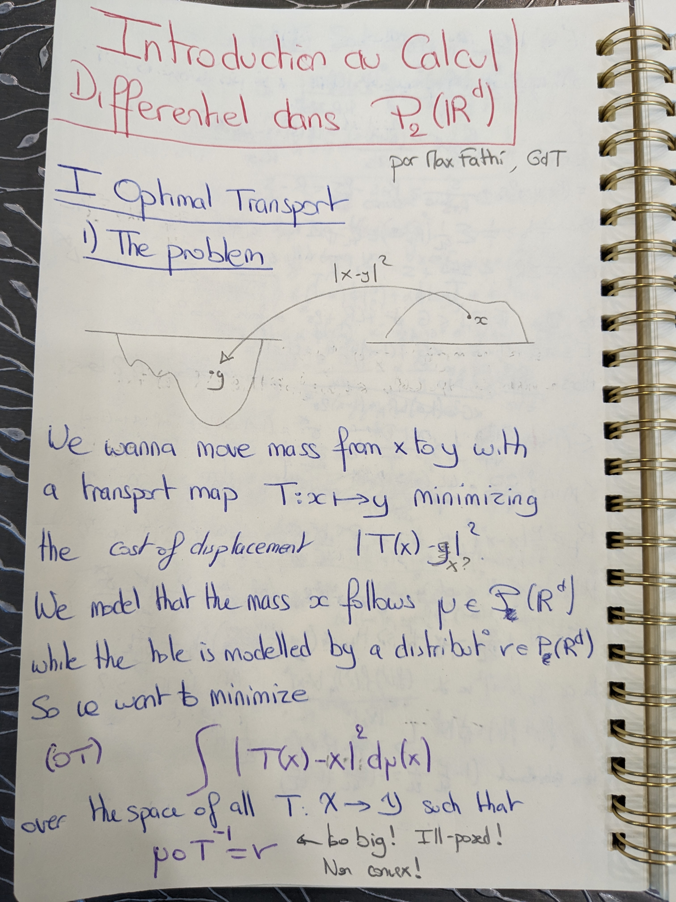 |
| ----------------- |
| 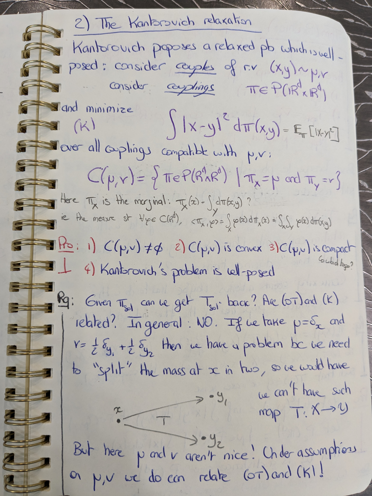 |
| 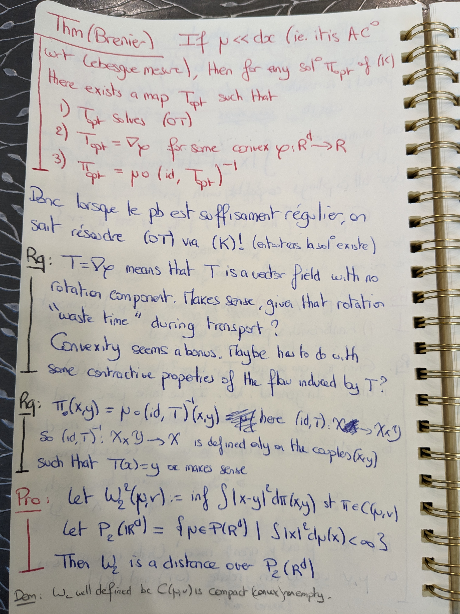 |
| 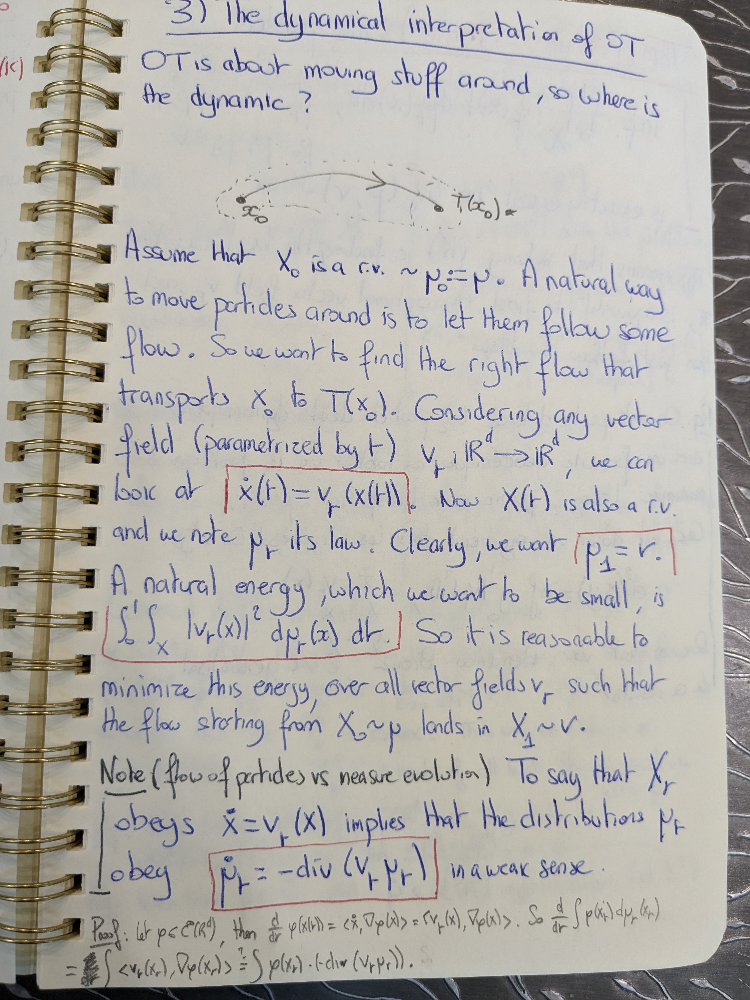 |
| 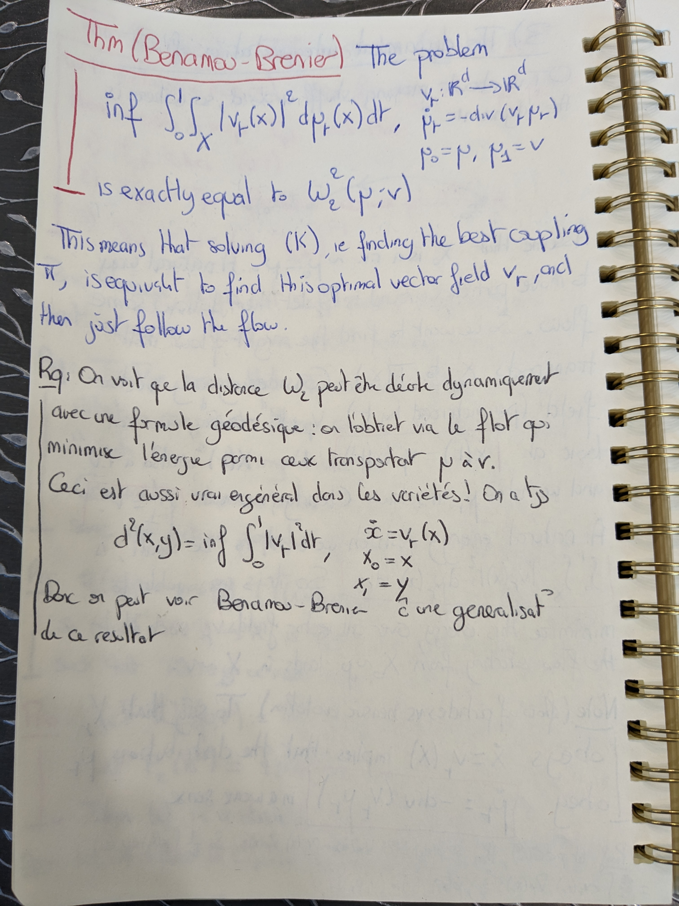 |
| 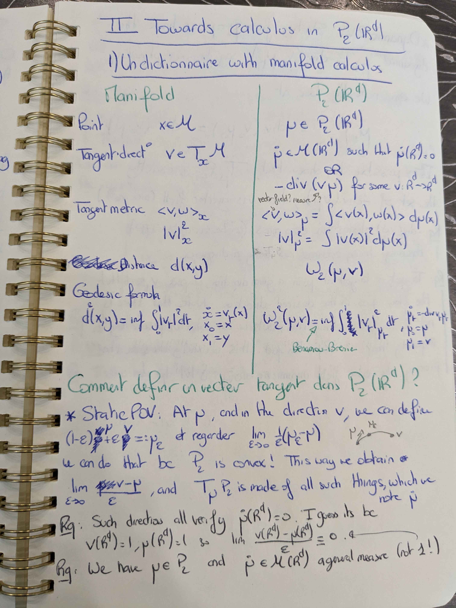 |
| 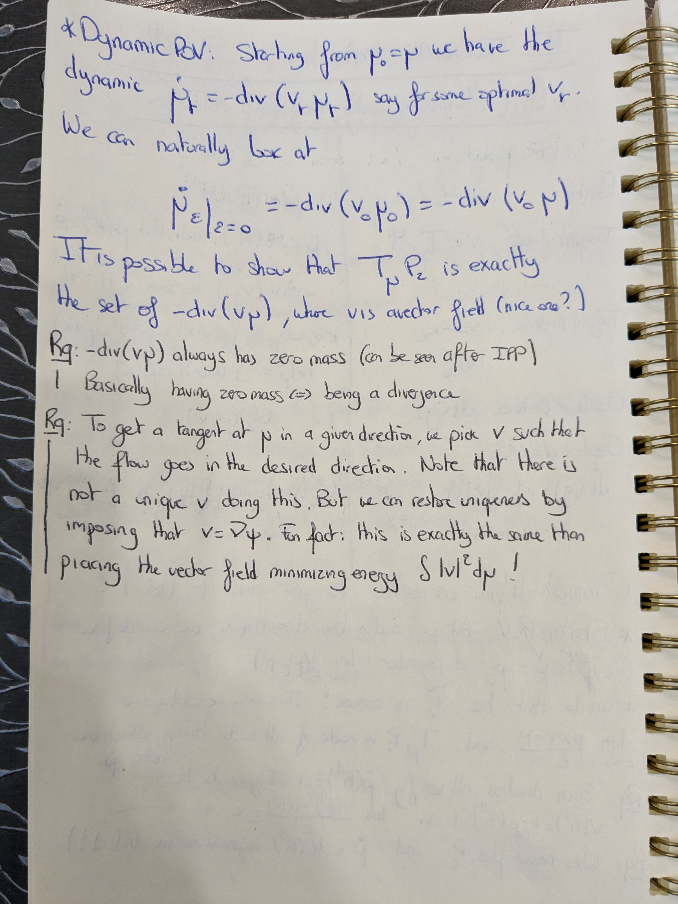 |
| 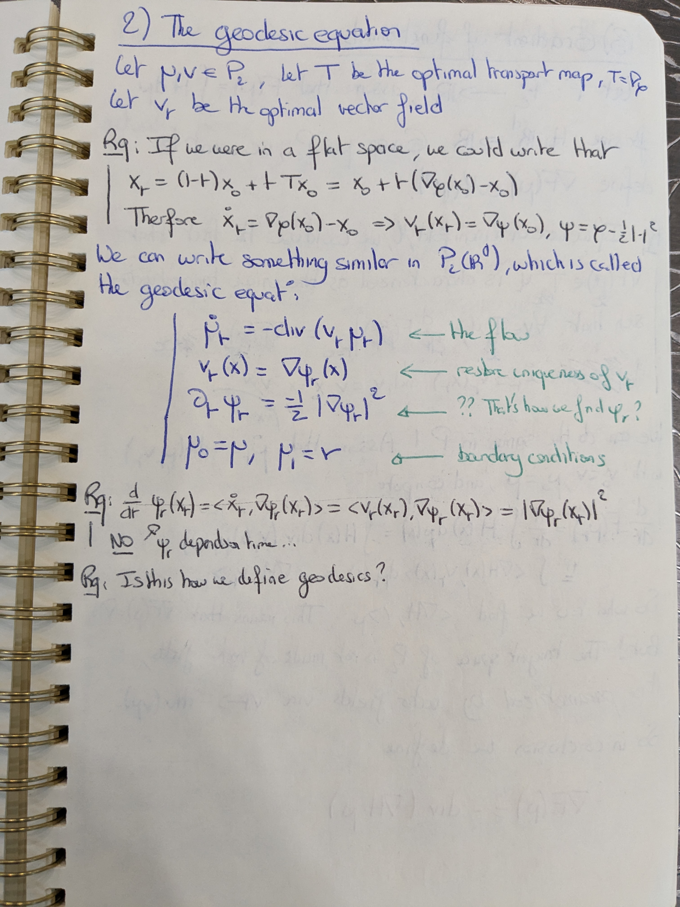 |
| 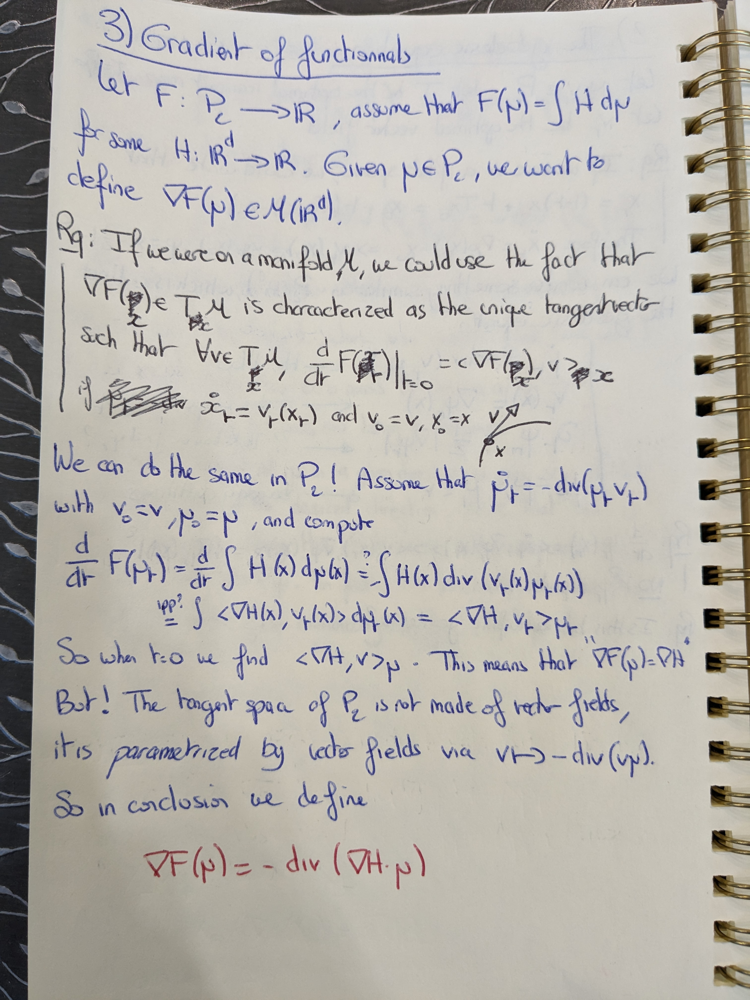 |
| 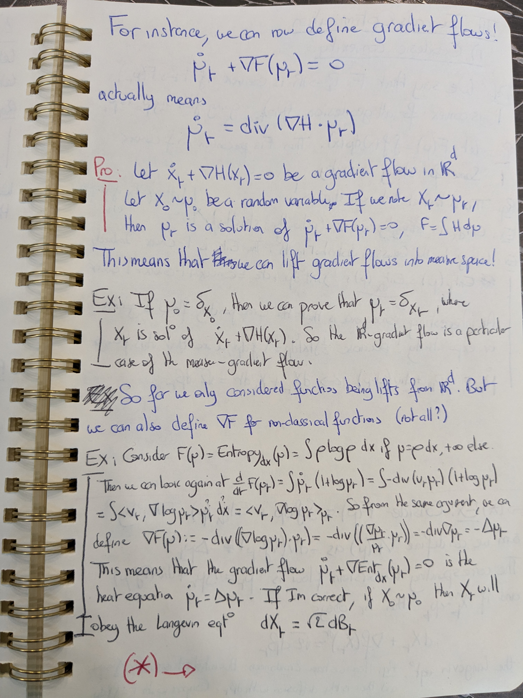 |
| 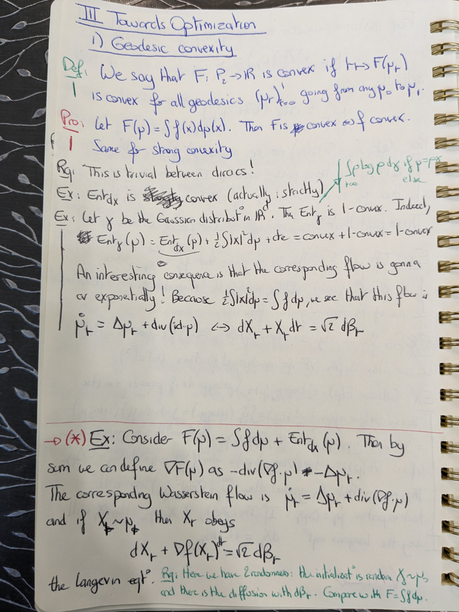 |
| 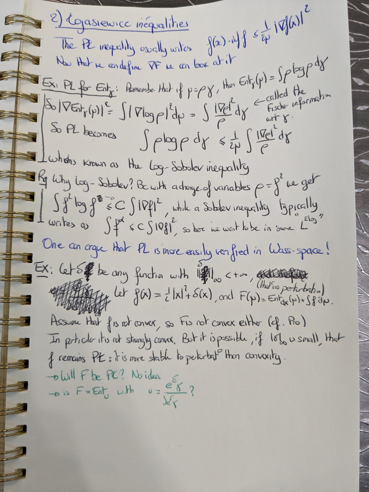 |

